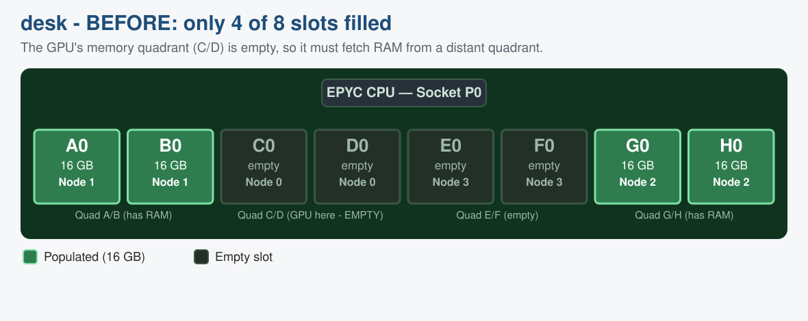
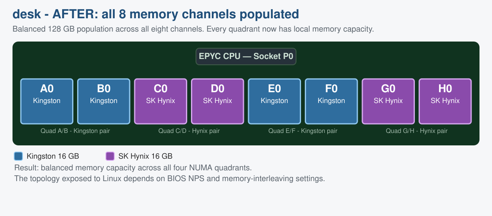

# Your GPU Isn't Slow. Your PCIe Path Is.

*Two ROCm systems, two x4 bottlenecks, and up to 4.5x higher host-to-device bandwidth after fixing the PCIe topology.*

> **Disclaimer:** This is a personal experiment from my own lab setup. Views are my own, and this is not official AMD guidance. Every performance number below comes from my two systems and my own measurements. Treat them as illustrative of these specific configurations, not as universal or representative results for the hardware named.

> If you train models and your data loading feels sluggish, this one is for you.

---

## The short version

| System                | Root cause                                 |   Before |      After | Improvement |
| --------------------- | ------------------------------------------ | -------: | ---------: | ----------: |
| MI210 + EPYC 7251     | Link configured at x4 instead of x16       | 3.6 GB/s | 14.35 GB/s |        4.0x |
| W7900 + Ryzen 7 3700X | GPU installed in chipset-connected x4 slot | 6.3 GB/s |  28.1 GB/s |        4.5x |

In both systems, the GPUs enumerated and ran workloads correctly. The failure was not functional; it was a silent reduction in available PCIe bandwidth. The rest of this write-up is how I found each one and confirmed the fix.

---

## What this is about

In a recent lab session, I set up two AMD GPU compute systems for ROCm work, and each one had the same kind of puzzling performance problem hiding inside it. Both machines could "see" their GPUs and run code just fine. But the speed of copying data *from the computer's main memory (RAM) into the GPU* was well below what the link should sustain. Correcting the PCIe configuration improved host-to-device bandwidth by approximately 4.0x on the MI210 system and 4.5x on the W7900 system. If you train models, this is exactly the kind of thing that quietly caps your data-loading throughput while everything still looks healthy. The story of how I found and fixed each one is a small tour through how modern computers actually move data around, and I found it a fun debug exercise worth a weekend post.

The numbers in this write-up are all from these two machines as I had them configured. They are meant to show a debugging method and the shape of the problem, not to serve as a benchmark of the GPUs or CPUs involved. Your own results will depend on your board, CPU, BIOS, and slot layout.

> **The one idea to take away:** A GPU can be working correctly and still deliver terrible performance if the *path* between the CPU and the GPU is degraded. Most of this write-up is about learning to inspect that path, link by link, instead of blaming the GPU.

---

## A little background you'll need

### What is a GPU doing in these machines?

A GPU (Graphics Processing Unit) is not just for graphics. It is a massively parallel calculator: it has many parallel compute units that do maths at the same time, which makes it ideal for AI, simulation, and scientific computing. **ROCm** is AMD's open-source software platform for GPU computing, including HPC and AI workloads.

### How does data get to the GPU?

The GPU has its own private memory (VRAM or HBM). Before the GPU can crunch a dataset, that data usually has to travel from the computer's main RAM, across a highway called **PCI Express (PCIe)**, into the GPU's VRAM. Think of PCIe as a multi-lane motorway between the CPU and the GPU. I was using discrete PCIe GPUs. On one system I had an AMD Instinct MI210 GPU, and on the other, an AMD Radeon PRO W7900 professional workstation GPU based on the AMD RDNA 3 architecture.

- **Lanes (width):** PCIe comes in widths like x1, x4, x8, x16, which is literally how many parallel lanes the system bus (highway) has. Think of x16 as the full-width road, and x4 is only a quarter of it.
- **Speed (generation):** Each PCIe "generation" (Gen3, Gen4, and so on) roughly doubles the speed per lane. Gen4 is twice as fast per lane as Gen3.

So total bandwidth is roughly lanes times speed-per-lane. A Gen4 x16 connection has an approximate post-encoding data-rate ceiling of 31.5 GB/s per direction. Large pinned host-to-device copies commonly land in the high-20s GB/s once PCIe protocol, host-memory, and software overheads are included. A crippled **Gen3 x4** link delivers only about 3.5 GB/s. That single fact turns out to be the villain of both stories below.

### The key measuring tool

I used a benchmark called **TransferBench** that copies a chunk of data from CPU memory to the GPU and reports the achieved speed in gigabytes per second (GB/s). I also leaned heavily on a Linux command, `lspci`, which lets you inspect every device on the PCIe bus and, most importantly, ask each link what speed and width it is actually running at right now.

> **How to read `LnkCap` vs `LnkSta`:** `LnkCap` tells you what an endpoint or port can support. `LnkSta` tells you the speed and width currently negotiated on that particular link. Always inspect the endpoint and every upstream port in the topology. A lower-than-expected `LnkSta` is an important clue, but it may reflect intentional slot wiring, bifurcation, a platform limitation, or a genuinely degraded link.

### A closer look at TransferBench

**TransferBench**  is an open source tool, and lives at https://github.com/ROCm/TransferBench. It copies a chunk of data between any two devices you name, whether those are CPU memory nodes or GPUs, and reports the speed it actually achieved. What makes it the right tool for this particular hunt is that it lets you choose *which engine does the copying*. A GPU can move data from host memory using either its dedicated DMA copy engine or its shader (compute) engines, and being able to run the very same copy both ways is what let me separate a copy-engine problem from a link problem. This is the "Is it the copy engine?" test from Machine 1, made concrete.

You describe a transfer as a little triplet, `SRC -> EXECUTOR -> DST`. The thing to hold onto when reading one is that the middle entry names an *engine*, while the two outer entries name *memory*.

The executor (the mover) is one of:

- `C` — CPU threads
- `G` — the GPU shader engines
- `D` — the GPU DMA engine

The source and destination (the memory) use `G` for GPU memory, and for host memory there is a whole menu to pick from:

- `C` — pinned host memory
- `B` — coherent pinned host memory
- `D` — non-coherent pinned host memory (in these experiments, the highest measured throughput for bulk copies into the GPU)
- `K` — uncached pinned host memory
- `H` — unpinned host memory (the slow one)
- `P` — pinned host memory that auto-lands on the NUMA node closest to the GPU

The simplified syntax begins with two counts: `#Transfers #SEs (SRC->EXECUTOR->DST)`. In `1 4 (D0->G0->G0)`, the first `1` requests one transfer, while `4` selects four subexecutors for the chosen executor. For a CPU executor, subexecutors correspond to CPU threads; for a GPU-kernel executor, they control the parallel GPU execution used for the transfer.

Yes, the letter `D` shows up in two places with two meanings. In the middle it is the DMA engine; on either end it is non-coherent pinned host memory. Context tells them apart. If you ever forget the letters your particular build supports, run `./TransferBench` with no arguments and it prints your machine's topology along with the memory types it knows about. Older builds expose fewer, so it is worth a quick check.

Here is a 1 GB copy from host into the MI210, driven by the DMA engine, taken after the slot was fixed:

```
$ ./TransferBench cmdline 1G "1 1 (D0->D0->G0)"

 Executor: DMA 00 │ 14.299 GB/s │ 75.091 ms │ 1073741824 bytes │ 14.351 GB/s (sum)
 Transfer 0       │ 14.351 GB/s │ 74.822 ms │ 1073741824 bytes │ D0 -> D0:1 -> G0
 Aggregate (CPU)  │ 14.261 GB/s │ 75.290 ms │ 1073741824 bytes │ Overhead 0.199 ms
```

Now the same copy again, except I hand the work to the GPU's shader engines instead of the DMA engine. All I change is the middle letter, from `D0` to `G0`, and I ask for 4 compute units:

```
$ ./TransferBench cmdline 1G "1 4 (D0->G0->G0)"
```

On this machine both come back at roughly 14.35 GB/s, and that agreement is the whole point. When the DMA and shader-driven paths produced essentially the same result, neither executor appeared to be the limiting factor; the shared PCIe path became the leading suspect. The road underneath is the ceiling here, which is the Gen3 x16 limit this platform imposes.

It is also handy to have a pure host-memory baseline with no GPU in the picture at all, just a CPU copy from one NUMA node to another. This is a good sanity check on your RAM and NUMA layout:

```
$ ./TransferBench cmdline 1G "1 4 (C1->C1->C2)"

 Executor: CPU 01 │ 12.396 GB/s │ 86.621 ms │ 1073741824 bytes │ 12.417 GB/s (sum)
 Transfer 0       │ 12.417 GB/s │ 86.472 ms │ 1073741824 bytes │ C1 -> C1:4 -> C2
 Aggregate (CPU)  │ 12.373 GB/s │ 86.784 ms │ 1073741824 bytes │ Overhead 0.163 ms
```

The documentation is at https://rocm.docs.amd.com/projects/TransferBench, and the source plus build instructions are on GitHub at https://github.com/ROCm/TransferBench.

One caveat worth flagging: the current TransferBench documentation notes it is tested on supported AMD Instinct GPUs but not on Radeon GPUs. The W7900 numbers here are still useful, but treat them as results observed in my configuration rather than an officially validated TransferBench characterization.

---

## Machine 1: "desk", the AMD Instinct MI210 server

### The setup

This machine is built around a **Gigabyte MZ01-CE0 server motherboard**, a first-generation AMD EPYC "Naples" server CPU (model 7251), and an **AMD Instinct MI210**, see https://www.amd.com/en/products/accelerators/instinct/mi200/mi210.html - a serious data-centre compute GPU. Ubuntu 24.04 and ROCm 7.14 installed cleanly, the GPU was recognised, and code ran on it. See https://rocm.docs.amd.com/en/latest/install/rocm.html?fam=instinct&os=ubuntu&ubuntu-ver=24.04&i=pkgman&gpu=mi210&gfx=gfx90a&w=compute 

The board reports itself as:

```
$ sudo dmidecode -t baseboard
Base Board Information
        Manufacturer: GIGABYTE
        Product Name: MZ01-CE0-00
        Version: 01010101
```

### The symptom

Copying 1 GB from CPU memory to the GPU took about 298 milliseconds every single time, which works out to a stubbornly fixed **3.6 GB/s**. For a data-centre GPU on a modern motherboard, that is dismal. Before checking the complete platform topology, I expected substantially more than 3.6 GB/s.

The most suspicious part was how *constant* it was. No matter what I changed, the answer came back 3.6 GB/s to the millisecond. In debugging, a result that refuses to move is itself a clue. It means something is imposing a hard ceiling, not a fluctuating one.

### How I investigated, and what each test ruled out

Good debugging is mostly elimination. Form a hypothesis, test it cheaply, cross it off. Here is the trail:

1. **Is it the copy engine?** GPUs can copy data using either dedicated DMA hardware or their compute cores. I tried both. Both gave 3.6 GB/s. *Ruled out.*
2. **Is it the type of memory?** There are several kinds of host memory (pinned, coherent, non-coherent, and so on). I swept through all of them. Every one came back at the identical 3.6 GB/s. *Ruled out.*
3. **Is it the security and translation layer (IOMMU)?** The IOMMU can translate addresses on every transfer. I switched it to "passthrough" mode and H2D bandwidth did not materially change, so the IOMMU was not the limiting factor here. *Ruled out.* One caveat worth noting: IOMMU configuration is workload-dependent, and Radeon PCIe P2P configurations may have different requirements from an Instinct compute configuration.
4. **Is the GPU asleep?** I watched the GPU's power and clocks during a transfer. It drew only about 50 W, barely above idle, so I forced maximum clocks anyway. Still 3.6 GB/s. *Ruled out.*
5. **Is the memory layout wrong (NUMA)?** This server splits its RAM into four "NUMA nodes", which you can think of as memory neighbourhoods. I found that the GPU's nearest neighbourhood had *no RAM installed in it at all*, forcing every transfer to reach into a distant neighbourhood. I fixed the RAM layout (shown below), which was genuinely worth doing, but it *still* did not move the 3.6 GB/s. Not the root cause, but good hygiene.
6. **Is the GPU itself the bottleneck?** I ran a copy that stays entirely inside the GPU, VRAM to VRAM. It hit **144 GB/s**. That substantially higher GPU-local copy result made a gross GPU-local memory bottleneck unlikely and directed the investigation toward the host interface.

> **The turning point:** The GPU-local copy was fast (144 GB/s) but every CPU-to-GPU copy was slow (3.6 GB/s). That pointed at the PCIe path rather than the GPU. So I stopped poking at software and started inspecting the physical link, port by port.

### Following the chain with `lspci`

A PCIe GPU appears within a hierarchy: the GPU endpoint connects to an upstream or root port, and some systems add further bridges or switches. On the GPU function at `03:00.0`, `LnkCap` advertised support for Gen4 x16, while `LnkSta` showed that the link had actually negotiated Gen3 x4. I then traced the topology and BIOS configuration to determine why only four lanes were active:

```
$ sudo lspci -vvv -s 03:00.0 | grep -iE 'LnkCap:|LnkSta:'
LnkCap: Speed 16GT/s, Width x16          <- capable of Gen4 x16
LnkSta: Speed 8GT/s (downgraded),        <- but actually running
        Width x4 (downgraded)               Gen3 and only x4 !!
```

There it was. The link had negotiated Gen3 x4. The x4 width was caused by the bifurcation configuration; Gen3 was the expected ceiling of this CPU and motherboard. Gen3 x4's real-world ceiling is about 3.5 to 3.9 GB/s, which matches my 3.6 GB/s *exactly*. Mystery solved.

### The fix

Why would a link run at x4 when it can do x16? On this board the culprit was a BIOS setting called **PCIe bifurcation**. Bifurcation lets one physical x16 slot be split into smaller pieces (x4+x4+x4+x4) so you can plug in several small devices. The slot holding the GPU had been left on an automatic setting that split it down to x4. I went into the BIOS and forced the GPU's slot (labelled PCIE_1) to **x16**.

After a reboot, the path reported full width, and the benchmark jumped:

| Stage | Link state | CPU to GPU bandwidth |
|---|---|---|
| Before | Gen3 x4 (bifurcated) | 3.6 GB/s |
| After forcing slot to x16 | Gen3 x16 | **14.35 GB/s** |

### Why it stopped at 14.35 GB/s, and why that is fine

After correcting the bifurcation configuration, the link operated at Gen3 x16 and H2D bandwidth increased from 3.6 to 14.35 GB/s. That result is consistent with the practical range of a Gen3 x16 connection. Although the MI210 endpoint supports PCIe 4.0 x16, both the EPYC 7251 and the published MZ01-CE0 slot specifications limit this platform to Gen3.

For reference, here is how each link type's approximate theoretical payload ceiling compares with what I actually measured:

| Link     | Approximate theoretical payload ceiling | My result |
| -------- | --------------------------------------: | ----------: |
| Gen3 x4  |                               3.94 GB/s |    3.6 GB/s |
| Gen3 x16 |                              15.75 GB/s |  14.35 GB/s |
| Gen4 x4  |                               7.88 GB/s |    6.3 GB/s |
| Gen4 x16 |                              31.51 GB/s |   28.1 GB/s |

Each measurement falls within the expected ballpark for its negotiated PCIe generation and width. The remaining gap reflects PCIe protocol overhead as well as host-memory, benchmark, and software-stack effects. Knowing when you have hit a true platform limit is as important as fixing a fault.

### A bonus fix along the way: the RAM layout

While digging around, I noticed only 4 of the 8 memory slots were filled, and in a pattern that left the GPU's own memory neighbourhood empty. I added 4 more matching DIMMs to fill all 8 channels. One subtle detail is worth calling out: this machine mixed two RAM brands (Kingston and SK Hynix), so I kept **each channel-pair the same brand** so the memory would train reliably. Populating all eight channels produced a balanced 128 GB configuration and gave each NUMA domain its own local memory capacity. (The number of NUMA nodes Linux actually exposes depends separately on the BIOS NPS and memory-interleaving settings.)

The diagrams below show the memory layout before and after. Each of the 8 slots (labelled A0 to H0) belongs to a "quadrant", a pair of channels that forms one memory neighbourhood (NUMA node):



*Figure 1. Before: only 4 slots filled, leaving the GPU's own quadrant (C/D) with no memory.*



*Figure 2. After: all 8 slots filled. Note how each channel-pair keeps a single brand, while the two brands alternate across quadrants.*

---

## Machine 2: "dev", the Radeon PRO W7900 workstation

### The setup

This machine uses an **ASUS TUF GAMING X570-PLUS (WI-FI) motherboard**, a **Ryzen 7 3700X**, a Zen 2-based desktop CPU with PCIe 4.0 support, and an **AMD Radeon PRO W7900** professional workstation GPU, https://www.amd.com/en/products/graphics/workstations/radeon-pro/w7900.html . Having just learned the lessons from the desk machine, I knew exactly what to check.

The board reports itself as:

```
$ sudo dmidecode -t baseboard
Base Board Information
        Manufacturer: ASUSTeK COMPUTER INC.
        Product Name: TUF GAMING X570-PLUS (WI-FI)
        Version: Rev X.0x
```

### The symptom

The CPU-to-GPU copy ran at **6.3 GB/s**. Better than desk's original number, but still far below the high-20s GB/s a Gen4 x16 link typically delivers. Same family of problem, different machine.

### The investigation, now much faster

I went straight to the PCIe chain with `lspci`, and the pattern was familiar. I checked the W7900 while it was installed in the lower full-length slot. `LnkCap` showed that the card supported Gen4 x16, while `LnkSta` showed that the installed link was operating at Gen4 x4:

```
$ sudo lspci -vvv -s <W7900-BDF> | grep -iE 'LnkCap:|LnkSta:'
LnkCap: Speed 16GT/s, Width x16
LnkSta: Speed 16GT/s, Width x4 (downgraded)
```

Notice the difference from desk. Here the *speed* was full Gen4, but the *width* was only x4. Gen4 x4 works out to about 6 to 7 GB/s, matching my 6.3 GB/s. The motherboard specification explained why: the lower full-length slot is connected through the X570 chipset and is electrically limited to x4. The cause was not a BIOS split this time; it was **which physical slot the card was plugged into**.

> **A key fact about desktop (consumer) motherboards:** A desktop CPU like the 3700X has a limited number of PCIe lanes. Typically **only the top slot (nearest the CPU) is wired for the full x16** directly to the CPU. Lower slots are routed through a secondary chip (the "chipset") and often run at just x4. The GPU had been installed in one of those lower, slower slots.

### The fix

I powered down and moved the W7900 into the **top slot, directly connected to the CPU**. While in the BIOS I also enabled a helpful option called "Above 4G Decoding" and looked for "Resizable BAR", which comes up again below. After a reboot, the upstream port finally reported full Gen4 x16, and the benchmark told the story:

| Stage | Link state | CPU to GPU bandwidth |
|---|---|---|
| Before (lower slot) | Gen4 x4 (slot wired x4) | 6.3 GB/s |
| After (top CPU slot) | Gen4 x16 | **28.1 GB/s** |

That is approximately a **4.5x improvement**, and this time it reached the platform's true maximum of full Gen4 x16, because this CPU and its top slot both support Gen4.

Here is the run that confirmed it, a 1 GB DMA copy from host into the W7900 once the card was in the top slot. Here `ROCR_VISIBLE_DEVICES=1` exposes physical GPU 1 as logical GPU 0 to the process, which is why the TransferBench expression uses `G0`:

```
:~/TransferBench$ ROCR_VISIBLE_DEVICES=1 ./TransferBench cmdline 1G "1 1 (D0->D0->G0)"
-------------------┬--------------┬------------┬-------------------┬--------------------
  Executor: DMA 00 │  28.110 GB/s │  38.198 ms │  1073741824 bytes │  28.257 GB/s (sum)
-------------------┼--------------┼------------┼-------------------┼--------------------
     Transfer 0    │  28.257 GB/s │  38.000 ms │  1073741824 bytes │ D0 -> D0:1 -> G0
-------------------┼--------------┼------------┼-------------------┼--------------------
   Aggregate (CPU) │  28.057 GB/s │  38.270 ms │  1073741824 bytes │ Overhead 0.072 ms
-------------------┴--------------┴------------┴-------------------┴--------------------
[WARN] Large BAR is not enabled for GPU 0 in BIOS. Large BAR is required to enable multi-gpu data access
```

Notice the warning at the bottom. The copy itself is running at full Gen4 x16, but TransferBench is reporting that Large BAR is off in the BIOS. The absence of Large BAR did not prevent this particular host-to-GPU test from reaching 28.1 GB/s, although it remained relevant to the subsequent peer-access experiment. Worth noting: Above 4G Decoding was enabled, but TransferBench still reported that Large BAR was unavailable. Above 4G Decoding and Resizable BAR are related platform capabilities, but enabling the former does not necessarily enable the latter.

### A second lesson: a fast card in the wrong slot

I then installed a second, older GPU (a Radeon PRO WX 8200) in the now-free lower slot, and asked a natural question: can the two GPUs send data directly to each other ("peer-to-peer")? In this configuration, the answer was **no**, and it is worth being precise about why.

This mixed W7900/WX 8200 configuration did not expose supported direct peer access. It helps to separate two things:

- **Direct GPU peer access**, where one GPU maps or transfers directly into another's memory.
- **Host-staged multi-GPU transfers**, which route through host memory and can still function even when direct peer access is unavailable.

A few points worth keeping straight:

- The older card, in the chipset-routed x4 slot, could only manage about 3.3 GB/s to the CPU, the same width limit as before, now expected rather than mysterious.
- PCIe P2P can operate without xGMI on supported GPU and platform combinations, but it depends on topology, Large BAR support, firmware, and runtime configuration. xGMI provides a dedicated high-bandwidth GPU interconnect on supported AMD Instinct platforms; it is not a universal prerequisite for GPU peer access.
- Large BAR (Resizable BAR) was not enabled in this board's BIOS, which is exactly the warning TransferBench printed above. Large BAR limitations can prevent direct peer mapping, but that does not mean all multi-GPU communication is impossible: host-staged transfers can still work.

---


## The engineering lessons

**1. Don't blame the obvious suspect first.** On both machines the GPU-local copy was fast (144 GB/s on desk), which pointed away from the GPU and toward the connection. Test a component in isolation before you assume it is the bottleneck.

**2. A constant, stubborn result is a clue.** On desk, the bandwidth stayed at 3.6 GB/s no matter what I changed. That refusal to budge was itself the signal. It pointed at a hard physical ceiling rather than any software setting.

**3. Distinguish capability from negotiated state.** A device's `LnkCap` can look perfect while `LnkSta` reveals that the link is operating at a lower generation or width. Check the endpoint first, then trace the topology through each upstream port to determine whether the cause is slot wiring, bifurcation, a switch, or a platform limitation.

**4. Match the symptom's number to a known cause.** 3.6 GB/s is Gen3 x4. 6.3 GB/s is Gen4 x4. 14 GB/s is Gen3 x16. 28 GB/s is Gen4 x16. Once you know these rough figures, a benchmark result translates straight into a physical diagnosis. (These are the ballpark figures I saw on my machines; treat them as rules of thumb, not exact specs.)

**5. Know when you've hit a real limit.** On desk I stopped at 14.35 GB/s because this platform tops out at Gen3, both the EPYC 7251 and the MZ01-CE0 slot specifications cap it there, regardless of the MI210's own Gen4 capability. Recognising a true hardware ceiling, instead of burning hours chasing a setting that cannot exist, is a mark of engineering maturity.

**6. Understand the platform's design intent.** Desktop motherboards, workstation platforms, and multi-GPU accelerator servers expose very different PCIe and peer-connectivity topologies. Some Instinct server designs provide dedicated Infinity Fabric links between GPUs, while conventional desktop systems generally rely on PCIe and motherboard-specific routing. Knowing what a machine was designed to do tells you what is worth attempting on it.

---

## Quick reference: useful commands

```bash
# Display the PCIe topology
lspci -tvnn

# Find GPU PCIe addresses
lspci -Dnn | grep -iE 'VGA|Display|AMD/ATI'

# Replace this with the GPU's actual domain:bus:device.function
BDF=0000:03:00.0

# Compare capability with current negotiated state
sudo lspci -vvv -s "$BDF" |
    grep -iE 'LnkCap:|LnkSta:'

# See which NUMA node the PCIe function is attached to
cat "/sys/bus/pci/devices/$BDF/numa_node"

# Inspect NUMA memory layout
numactl --hardware

# Check the IOMMU mode
cat /proc/cmdline
sudo dmesg | grep -i 'Default domain type'
```

---

*From "it works but it's slow" to a measured, well-understood PCIe path—one link at a time.*
